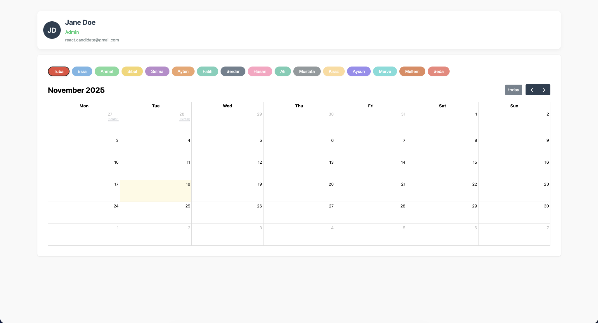
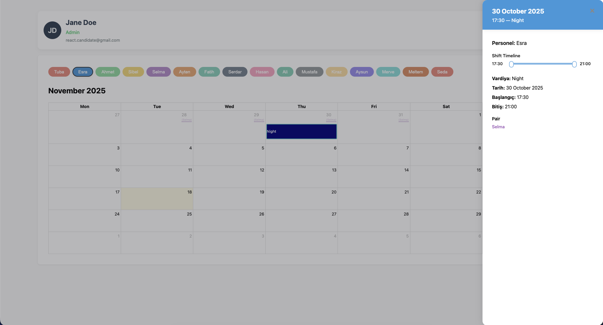

# Shift Yönetimi Çözümü – Tamamlanmış Task

Bu depo, verilen **Shift Yönetimi** (Shift Management) frontend task'ının tamamlanmış çözümünü içermektedir.

Projede **takvim görünümü**, **modal yapısı** ile shift detay gösterimi ve **shift güncelleme akışı** sorunsuz şekilde uygulanmıştır. Kod yapısı **modüler**, **okunabilir** ve **edge-case** senaryolarına karşı güvenlidir.

---

## 🚀 Özellikler

- 📅 **Aylık takvim görünümü**
- 🟦 **Modal** ile shift detay gösterimi
- 🔄 **Shift güncelleme** akışı ve **form yapısı**
- ⚠️ Boş veya hatalı veri durumları için **edge-case kontrolleri**
- ♻️ **Temiz** ve **modüler component mimarisi**
- 📱 **Responsive tasarım** desteği
- 🔌 **API yapısına uygun veri işleme** fonksiyonları

---

## 🛠️ Kullanılan Teknolojiler

- **React** / **Next.js**
- **Bootstrap** veya **SCSS** (Stil Yönetimi)
- **Axios** (API İstekleri)
- **Context API** veya **Redux Toolkit** (Global Durum Yönetimi)
- **React Icons**

---

## 📦 Kurulum

Projeyi yerel makinenizde çalıştırmak için aşağıdaki adımları takip edin:

```bash
git clone <this-repo-link> # Depoyu klonlayın
cd project-folder         # Proje dizinine gidin
npm install               # Bağımlılıkları yükleyin
npm run dev               # Geliştirme sunucusunu başlatın
```

Ardından tarayıcıdan:

http://localhost:3000 adresine gidin.

📸 Ekran Görüntüleri

📅 Takvim Görünümü


Aylık shift takviminin temel görünümü:

🟦 Modal Yapısı


Gün detayına tıklanınca açılan modal ekranı:

🔄 Shift Update


Shift güncelleme formu ve güncelleme akışı:

🧩 Ek Yapılan İyileştirmeler
Component mimarisi sadeleştirildi ve tekrar kullanılabilir şekilde düzenlendi.

UI tutarlılığı için ince görsel iyileştirmeler yapıldı.

API hataları, boş gün veya boş shift listesi gibi edge-case senaryoları ele alındı.

Kod okunabilirliği artırılarak mantıksal yapılar ayrıştırıldı.

Mobil uyumluluk geliştirildi ve responsive düzenler optimize edildi.

Görkem Paşaoğlu
